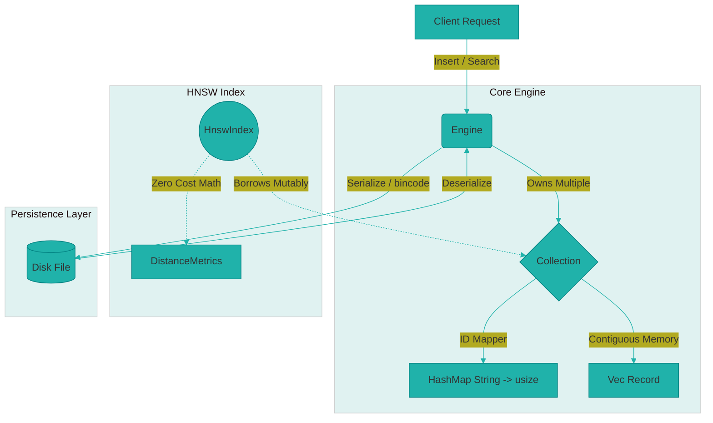

<div align="center">
  
# 🌌 VecDB Engine

[]()
[]()
[]()

**A high-performance, structurally modular Vector Database Engine.**

</div>

---

## ⚡ Overview

VecDB is a highly optimized vector database engine built entirely from scratch in Rust. Designed with strict systems architecture principles, it focuses on memory efficiency, zero-cost abstractions, and blazing-fast approximate nearest neighbor (ANN) search capabilities.

By mapping user string IDs to sequential internal integers, VecDB ensures that its **Hierarchical Navigable Small World (HNSW)** graph traversal operates entirely within contiguous memory blocks (`Vec<Record>`), guaranteeing maximal CPU cache-locality and zero heap-allocations during the hot loop.

## 💎 Core Features

- **Blazing Fast HNSW Architecture**: Navigates multi-layered undirected graphs for highly optimized sub-linear search complexity.
- **Cache-Optimized Memory Layout**: Converts String IDs into sequential `usize` indices internally, allowing for $O(1)$ memory access during graph jumps. No `String` cloning in the search path.
- **Zero-Cost Distance Metrics**: Built around static trait dispatch (`PhantomData` and generics). Distance operations (Cosine, Euclidean) are perfectly inlined by the compiler.
- **Durable Persistence**: Native `bincode` binary serialization via `serde` ensures the database state is safely saved and loaded from disk in milliseconds.
- **Strict Error Handling**: Full integration with `thiserror` for deterministic, robust error domains (`EngineError`, `CollectionError`).

## 🏗️ System Architecture



## 🚀 Quick Start

```rust
use vec_db::entities::{Engine, EngineTrait, CollectionTrait};
use vec_db::metrics::CosineDistance;
use vec_db::hnsw::HnswIndex;

fn main() {
    // 1. Initialize a new engine or load from disk
    let mut engine = Engine::new("production_engine");
    
    // 2. Create a vector collection
    engine.create_collection("document_embeddings").unwrap();
    
    // 3. Borrow the collection to interact with the HNSW Index
    let mut collection = engine.get_collection_mut("document_embeddings").unwrap();
    let mut index = HnswIndex::<CosineDistance>::new(&mut collection);
    
    // 4. Insert records (User string IDs are internally mapped to usize)
    // index.insert(record);
    
    // 5. Save state
    engine.save_path = Some("vdb_data.bin".to_string());
    engine.save_to_disk().unwrap();
}
```

## 🗺️ Development Roadmap

- ✅ **Phase 1: Foundation**: Core structs, static distance metrics, HNSW index foundation, custom error handling.
- ✅ **Phase 2: Persistence**: Disk persistence via `serde` and `bincode` to save and load the `Engine` state across restarts.
- ✅ **Phase 3: Performance Optimization**: Refactored internal graph traversal to use sequential integer mapping and contiguous memory `Vec<Record>`, eliminating heap allocations in the hot path.
- 🚧 **Phase 4: Concurrency & API**: Wrapping the engine in `Arc<RwLock>` and exposing async HTTP endpoints using `tokio` and `axum`.

## 📜 License

This project is licensed under the MIT License.
