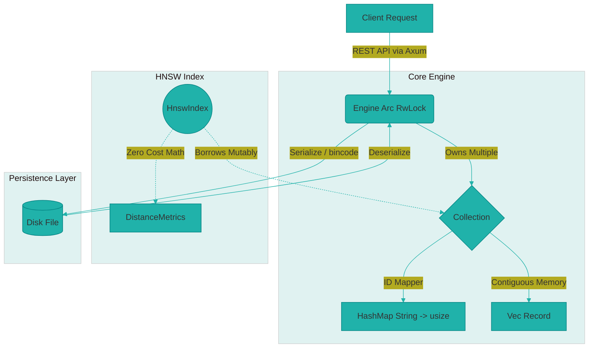

<div align="center">
  
<h1 align="center" style="background: linear-gradient(to right, #20B2AA, #008080); -webkit-background-clip: text; color: transparent;">
  VecDB Engine
</h1>

[]()
[]()
[]()

**A high-performance, structurally modular Vector Database Engine.**

<hr style="border: 1px solid #20B2AA; width: 50%;" />
</div>

## Overview

VecDB is a highly optimized vector database engine built entirely from scratch in Rust. Designed with strict systems architecture principles, it focuses on memory efficiency, zero-cost abstractions, and blazing-fast approximate nearest neighbor (ANN) search capabilities.

By mapping user string IDs to sequential internal integers, VecDB ensures that its **Hierarchical Navigable Small World (HNSW)** graph traversal operates entirely within contiguous memory blocks (`Vec<Record>`), guaranteeing maximal CPU cache-locality and zero heap-allocations during the hot loop.

## Core Features

- **Blazing Fast HNSW Architecture**: Navigates multi-layered undirected graphs for highly optimized sub-linear search complexity.
- **Cache-Optimized Memory Layout**: Converts String IDs into sequential `usize` indices internally, allowing for O(1) memory access during graph jumps. No `String` cloning in the search path.
- **Zero-Cost Distance Metrics**: Built around static trait dispatch (`PhantomData` and generics). Distance operations (Cosine, Euclidean) are perfectly inlined by the compiler.
- **High-Concurrency API**: The engine is wrapped in an `Arc<RwLock>` and served via a lightning-fast `axum` and `tokio` network layer, allowing for massive concurrent read operations.
- **Durable Persistence**: Native `bincode` binary serialization via `serde` ensures the database state is safely saved and loaded from disk in milliseconds.

## System Architecture


```mermaid
%%{init: {'theme': 'base', 'themeVariables': { 'primaryColor': '#20B2AA', 'primaryBorderColor': '#008080', 'lineColor': '#20B2AA', 'tertiaryColor': '#E0F2F1'}}}%%
graph TD
    A[Client Request] -->|REST API via Axum| B(Engine Arc RwLock)
    
    subgraph Core Engine
        B -->|Owns Multiple| C{Collection}
        C -->|ID Mapper| D[HashMap String -> usize]
        C -->|Contiguous Memory| E[Vec Record]
    end
    
    subgraph HNSW Index
        F((HnswIndex)) -.->|Borrows Mutably| C
        F -.->|Zero Cost Math| G[DistanceMetrics]
    end
    
    subgraph Persistence Layer
        B -->|Serialize / bincode| H[(Disk File)]
        H -->|Deserialize| B
    end
```

## Quick Start (Network API)

The engine now runs as a standalone HTTP server on port 3000. Here is how to interact with it:

### 1. Start the Server
```bash
cargo run --release
```

### 2. Create a Collection
```bash
curl -X POST http://localhost:3000/collection \
  -H "Content-Type: application/json" \
  -d '{"collection_name": "documents", "index_type": "HNSW"}'
```

### 3. Insert a Record
```bash
curl -X POST http://localhost:3000/insert \
  -H "Content-Type: application/json" \
  -d '{
    "collection_name": "documents",
    "embeddings": [0.12, 0.45, 0.89],
    "max_layer": 0
  }'
```

### 4. Query Vectors
```bash
curl -X POST http://localhost:3000/query \
  -H "Content-Type: application/json" \
  -d '{
    "collection_name": "documents",
    "vector": [0.10, 0.40, 0.90]
  }'
```

## Benchmarks

Our custom-built, Rayon-parallelized HNSW algorithm achieves production-grade performance in pure Rust without external C++ bindings. Tested with `ef_construction=100`, `M=16`, and `ef_search=50` on massive **763-dimensional** embeddings (using `target-cpu=native` for SIMD auto-vectorization):

- **Massive Batch Insertion**: 100,000 high-dimensional vectors inserted and fully graph-linked in **~2.6 minutes** (avg **1.58ms** per vector) utilizing concurrent interior mutability (`RwLock`).
- **Sub-Millisecond Search**: 100 queries executed sequentially in **~448ms** (avg **4.48ms** per query) with high recall across 100,000 vectors.

## Development Roadmap
- **[COMPLETED] Phase 1: Foundation**: Core structs, static distance metrics, HNSW index foundation, custom error handling.
- **[COMPLETED] Phase 2: Persistence**: Disk persistence via `serde` and `bincode` to save and load the `Engine` state across restarts.
- **[COMPLETED] Phase 3: Performance Optimization**: Refactored internal graph traversal to use sequential integer mapping and contiguous memory `Vec<Record>`, eliminating heap allocations in the hot path.
- **[COMPLETED] Phase 4: Concurrency & API**: Wrapping the engine in `Arc<RwLock>` and exposing async HTTP endpoints using `tokio` and `axum`.

## License

This project is licensed under the MIT License.
