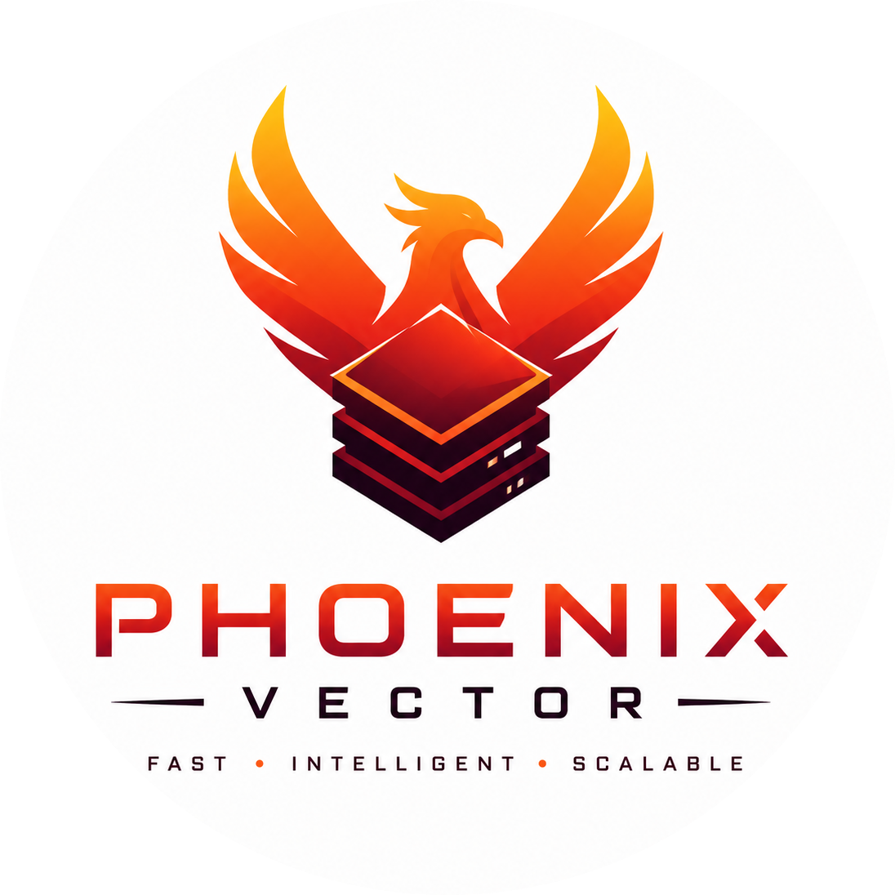
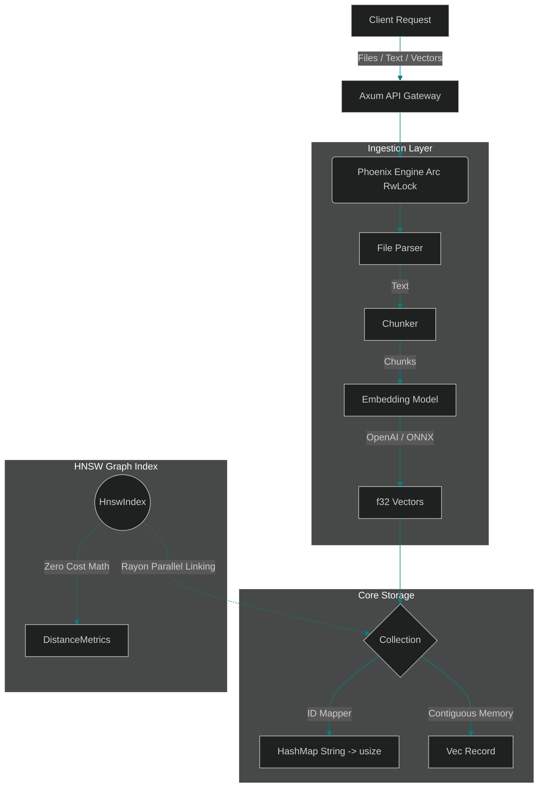

  
<h1 align="center" style="background: linear-gradient(to right, #6A0DAD, #008080); -webkit-background-clip: text; color: transparent; font-size: 3em; font-weight: bold;">
  Phoenix-Vector
</h1>

**A Multi-Threaded Vector Database Engine in Pure Rust.**

##  Overview

Phoenix-Vector is a highly optimized vector database engine and AI-native ingestion platform built entirely from scratch in Rust. Designed with strict systems architecture principles, it focuses on memory efficiency, zero-cost abstractions, multi-threaded CPU saturation, and blazingly fast approximate nearest neighbor (ANN) search capabilities.

Unlike standard vector databases that only accept floating-point arrays, **Phoenix-Vector is an end-to-end platform**. It can ingest raw files (`.pdf`, `.docx`, `.xlsx`, `.txt`), automatically chunk them, embed them using neural networks (like OpenAI or local ONNX models), and build a highly concurrent HNSW graph index in seconds.

## Core Features

- **Blazing Fast HNSW Architecture**: Navigates multi-layered undirected graphs for highly optimized sub-linear $O(\log N)$ search complexity.
- **Rayon-Powered Parallel Construction**: Batch ingestion operations are heavily parallelized across all CPU cores using `rayon` and granular `parking_lot::RwLock` interior mutability.
- **End-to-End Ingestion Pipeline**: Native support for parsing, chunking, and embedding PDF, DOCX, XLSX, and TXT files directly into the graph.
- **Cache-Optimized Memory Layout**: Converts String IDs into sequential `usize` indices internally, allowing for $O(1)$ memory access during graph jumps with zero heap-allocations in the hot loop.
- **High-Concurrency API**: The engine is wrapped in an `Arc<RwLock>` and served via a lightning-fast `axum` and `tokio` network layer.
- **Durable Persistence**: Native `bincode` binary serialization via `serde` ensures the entire engine state is safely saved and loaded from disk in milliseconds.

##  System Architecture

```mermaid
%%{init: {'theme': 'dark', 'themeVariables': { 'primaryColor': '#4B0082', 'primaryBorderColor': '#008080', 'lineColor': '#008080', 'tertiaryColor': '#1A1A1A'}}}%%
graph TD
    A[Client Request] -->|Files / Text / Vectors| B[Axum API Gateway]
    B --> C(Phoenix Engine Arc RwLock)
    
    subgraph Ingestion Layer
        C --> D[File Parser]
        D -->|Text| E[Chunker]
        E -->|Chunks| F[Embedding Model]
        F -->|OpenAI / ONNX| G[f32 Vectors]
    end
    
    subgraph Core Storage
        G --> H{Collection}
        H -->|ID Mapper| I[HashMap String -> usize]
        H -->|Contiguous Memory| J[Vec Record]
    end
    
    subgraph HNSW Graph Index
        K((HnswIndex)) -.->|Rayon Parallel Linking| H
        K -.->|Zero Cost Math| L[DistanceMetrics]
    end
```

##  Benchmarks

Our custom-built, Rayon-parallelized HNSW algorithm achieves production-grade performance in pure Rust without external C++ bindings. 

**Testing Hardware Specifications:**
- **CPU**: Intel Core i5 (10th Gen)
- **RAM**: 12 GB
- **GPU**: None (Pure CPU SIMD Execution)

Tested with `ef_construction=100`, `M=16`, and `ef_search=50` (using `target-cpu=native` for SIMD auto-vectorization):

### 100K Dataset (Heavy Dimensions: 763)
- **Massive Batch Insertion**: 100,000 vectors inserted and fully graph-linked in **~2.6 minutes** (avg **1.58ms** per vector).
- **Sub-Millisecond Search**: 100 queries executed sequentially in **~448ms** (avg **4.48ms** per query) with high recall.

### 1 MILLION Dataset (Standard Dimensions: 384)
- **Extreme Scale Insertion**: 1,000,000 vectors generated in-memory and graph-linked in **~18.8 minutes** (avg **1.13ms** per vector) across CPU cores.
- **Logarithmic Search Magic**: 100 queries executed in **~327ms** (avg **3.27ms** per query). Despite the dataset being 10x larger, the search time stayed identical due to the $O(\log N)$ HNSW graph traversal!

##  Development Roadmap

- **[COMPLETED] Phase 1: Foundation**: Core structs, static distance metrics, HNSW index foundation, custom error handling.
- **[COMPLETED] Phase 2: Persistence**: Disk persistence via `serde` and `bincode`.
- **[COMPLETED] Phase 3: Performance Optimization**: Refactored internal graph traversal to use sequential integer mapping and contiguous memory `Vec<Record>`.
- **[COMPLETED] Phase 4: Concurrency & API**: Wrapping the engine in `Arc<RwLock>` and exposing async HTTP endpoints using `tokio` and `axum`.
- **[COMPLETED] Phase 5: Parallel Construction**: Implementing `rayon` and `RwLock` primitives for highly parallel batch processing.
- **[COMPLETED] Phase 6: Document Ingestion Layer**: Built a native file parser (PDF, DOCX, XLSX, TXT) and text chunking pipeline.
- **[IN PROGRESS] Phase 7: Embedding Connectors**: Building the `reqwest` integration for OpenAI/Ollama and `fastembed` for local ONNX execution.
- **[PLANNED] Phase 8: Scalar Quantization**: Implementing vector compression to reduce memory footprint by 75% and dramatically increase math throughput.

##  License

This project is licensed under the MIT License.
